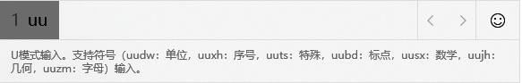
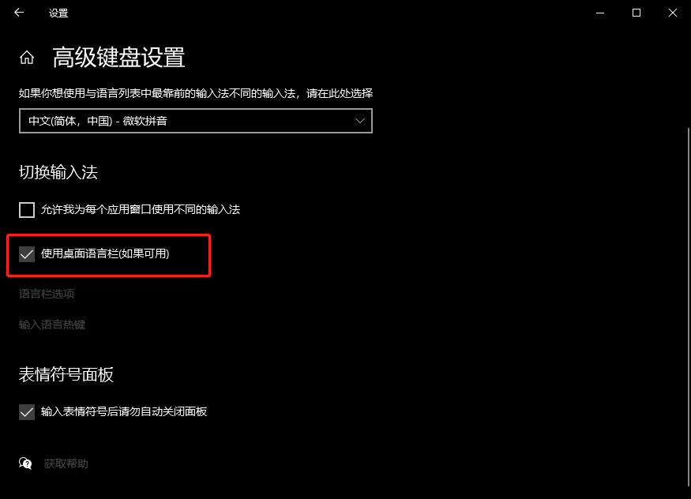

# Windows常见技巧&操作：

- [Windows常见技巧&操作：](#windows常见技巧操作)
  - [输入法](#输入法)
    - [全半角切换](#全半角切换)
    - [输入技巧：（微软拼音）](#输入技巧微软拼音)
    - [误操作解决方法](#误操作解决方法)

## 输入法

### 全半角切换

全角状态下使用快捷键 Shift+Space 快速切换半角。

遇到 Shift+Space 不能使用的情况，鼠标右击右下角输入法 -- 按键设置，将"全/半角切换"的快捷键勾选即可。

其他输入快捷键：

| **繁简切换**       | **Ctrl+Shift+F** |
| ------------------ | ---------------- |
| **中英文标点切换** | **Ctrl+句点**    |

### 输入技巧：（微软拼音）

详细可参考：[Windows 10 原生输入法技巧](https://sspai.com/post/41266)

- **U模式**
  - u+各个部分的读音 例如犇（ben一声) —— uniuniuniu犇
  - u+笔画 例如:upn乄（wu三声）—— upn㐅
    - 规则：「横、竖、撇、捺、折」五种基本笔画分别由其拼音首字母「h、s、p、n、z」表示，例如「u'spnp」可以输入「少」字。
  - uu模式：可通过uu模式快捷输入各种特殊字符3
    
- **V模式**
  - v+数字可以显示数字的各种形式
  - v+算式可以直接得到结果
- **简写**
  - rq得到日期， sj得到具体时间
- **人名输入**
  - 输入好人名拼音后按 "；+ r "进入人名输入模式，按 "；"退出。

### 误操作解决方法

如果不小心启动了桌面语言栏：

（关闭方法）打开设置 -- 设备 -- 输入 -- 更多键盘设置 -- 高级键盘设置 -- 使用桌面语言栏（如果可用）

取消勾选即可。

（持续更新...）

