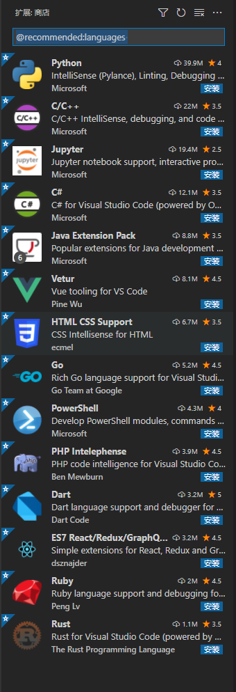

# VSCode安装与配置：

## VSCode下载：

地址首页：[Visual Studio Code](https://code.visualstudio.com/)  —— 下载页：[Visual Studio Code Download](https://code.visualstudio.com/Download)

首页也可以下载，但是下载页的分类很详细。 可以选择**User Installer**和**System Installer**，更方便。

注：选择User Installer是不能将安装地址选择在User以外的文件夹的。


## VSCode安装与配置：

### 一、安装：

#### 注意：

> - [x] 将“通过code 打开“操作添加到windows资源管理器文件上下文菜单
>
> - [x] 将“通过code 打开”操作添加到windows资源管理器目录上下文菜单
>
> - [ ] 将code注册为受支持的文件类型的编辑器
>
> - [x] 添加到PATH（重启后生效）

说明：①②勾选上，可以对文件，目录点击鼠标右键，选择使用 VScode 打开。

说明：默认使用 VScode 打开诸如 txt,py 等文本类型的文件，一般建议不勾选。

说明：这步骤默认的，勾选上，不用配环境变量，可以直接使用。


#### 提示：

如果没有勾选文件和目录的上下文菜单，可参考此链接：[将VScode添加至右键菜单](https://www.cnblogs.com/kangyupl/p/13525258.html) 新建reg文件将值添加到注册表。

**（强烈建议重新安装，不用卸载直接覆盖安装即可）**

```
Windows Registry Editor Version 5.00

[HKEY_CLASSES_ROOT\*\shell\VSCode] ;右击文件时弹出的菜单
@="Edit with Visual Studio Code" ;显示的文字
"Icon"="D:\\Program Files\\Microsoft VS Code\\Code.exe" ;显示的图标

[HKEY_CLASSES_ROOT\*\shell\VSCode\command] ;要执行的命令
@="\"D:\\Program Files\\Microsoft VS Code\\Code.exe\" \"%1\"" ;具体的命令代码，%1代表第一个参数，即右击选中的那个文件的路径

Windows Registry Editor Version 5.00

[HKEY_CLASSES_ROOT\Directory\shell\VSCode] ;右击文件夹时弹出的菜单
@="Open with Visual Studio Code"
"Icon"="D:\\Program Files\\Microsoft VS Code\\Code.exe"

[HKEY_CLASSES_ROOT\Directory\shell\VSCode\command]
@="\"D:\\Program Files\\Microsoft VS Code\\Code.exe\" \"%V\"" ;%V意思同%1，只不过在路径为空时替换为当前工作路径
```


### 二、配置：

#### 创建工作区 & 设置语言

​	创建文件夹："D:\_MyCode_Project\code_workspace"，右键"Open with Visual Studio Code"

​	下载插件：Chinese (Simplified) Language Pack for Visual Studio Code

#### JSON文件配置

##### **settings.json** （参考[史上最全vscode配置使用教程](https://zhuanlan.zhihu.com/p/113222681)）

*文件--首选项--设置*，打开用户设置。VScode支持选择配置，也支持编辑setting.json文件修改默认配置。

新版的vscode设置默认为UI的设置，可以通过  *工作台--设置编辑器*  将"配置默认使用的设置编辑器"由 ui 改为 json。新安装的VSCode的json文件为空。

（当然也可以通过 "Ctrl + Shift + P” 搜索 settings.json 直接打开）

注意settings.json删除某一项意味着对应项恢复默认设置，当然全删就是全部恢复默认。


- **光标配置**：

  ```json
  "editor.cursorBlinking": "smooth",  // 光标样式
  "editor.cursorSmoothCaretAnimation": true,  // 光标平滑过渡
  ```

  

- **字体配置**：JetBrains Mono — https://www.jetbrains.com/lp/mono/ 解压后全选，安装

  settings.json设置：

  ```json
  "editor.fontFamily": "'JetBrains Mono', Consolas, monospace", // 优先使用第一个字体
  "editor.fontLigatures": true,  // 启用字体连体，设置完后需重启
  ```


- **启用Tab补全 & 控制是否在键入时自动显示建议**

  ```json
  "editor.tabCompletion": "on",
  "editor.quickSuggestions": true, //控制是否在键入时自动显示建议。
  ```

  

- **自动保存**：

  ```json
  "files.autoSave": "afterDelay",
  "files.autoSaveDelay": 5000,  // 每五秒自动保存一次
  ```

以上基本OK，还可以根据具体情况配置字体大小等。

- **个人大电脑配置**：

  ```json
  {
      "editor.cursorBlinking": "smooth",
      "editor.cursorSmoothCaretAnimation": true,
      "editor.fontFamily": "'JetBrains Mono', Consolas, monospace",
      "editor.fontLigatures": true,
      "editor.fontSize": 16,
      "editor.minimap.scale": 2,
      "files.autoSave": "afterDelay",
      "files.autoSaveDelay": 5000,
      "editor.suggest.snippetsPreventQuickSuggestions": false,
      "editor.tabCompletion": "on",
      "editor.quickSuggestions": true,
  }
  ```

  

### 三、彩蛋：

#### 卸载VSCode：[彻底卸载VSCode](https://blog.csdn.net/qq_29339467/article/details/104074758)

#### 一键查看支持的语言扩展：在扩展商店输入@recommended:languages 


