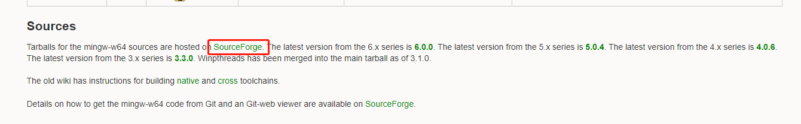
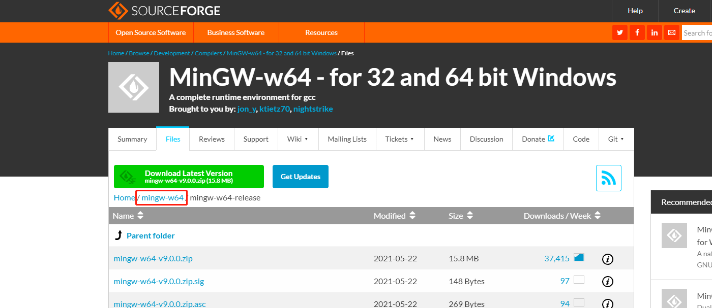
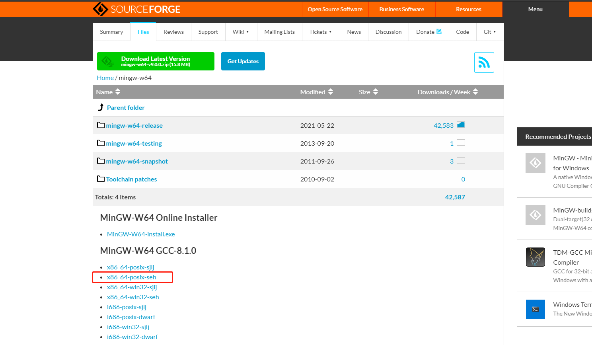

# MinGW-w64 安装和使用

### 关于MinGW与MinGW-w64的问题：

MinGW和MinGW-w64都是C/C++的编译器，推荐使用MinGW-w64。

> 以下链接是一篇关于MinGW与MinGW-w64的科普：
>
> [科普MinGW MinGW-W64](https://blog.csdn.net/whatday/article/details/87113007)

简单概括就是：MinGW-W64是GCC官方支持的，且MinGW已经停止更新。

### 下载和安装MinGW-w64：

官网：http://mingw-w64.org/

点击首页的DownLoad，进入下载页面，上面的都是一些编译器的发行版本，不用管，直接下滑找到Source板块，第一句话就是：

> Tarballs for the mingw-w64 sources are hosted on [SourceForge](http://sourceforge.net/projects/mingw-w64/files/mingw-w64/mingw-w64-release/). 

点击  [SourceForge](http://sourceforge.net/projects/mingw-w64/files/mingw-w64/mingw-w64-release/) 

后退到 [Home/mingw-w64](https://sourceforge.net/projects/mingw-w64/files/mingw-w64/)

选择[x86_64-posix-seh](https://sourceforge.net/projects/mingw-w64/files/Toolchains%20targetting%20Win64/Personal%20Builds/mingw-builds/8.1.0/threads-posix/seh/x86_64-8.1.0-release-posix-seh-rt_v6-rev0.7z/download)

以下是MinGW-w64不同版本区别的说明：

> #### 释义1：
>
> - DWARF：一种带调试信息(DWARF- 2（DW2）EH)的包, 所以比一般的包尺寸大，仅支持32位系统
> - SJLJ：跨平台，支持32，64位系统，缺点是：运行速度稍慢，GCC不支持
> - SEH: 调用系统机制处理异常，支持32，64位系统，缺点是：Gcc不支持（即将支持）
>
> #### 释义2：
>
> - x86_64: 简称X64，64位操作系统
> - i686: 32位操作系统 (i386的子集)，差不多奔腾2(1997年5月)之后的CPU都是可以用的；
>
> #### 释义3：
>
> - posix: 启用了C++ 11 多线程特性
> - win32: 未启用 （从时间线上正在尝试也启用部分 Threading）
>
> #### 区别
>
> - DWARF DWARF- 2（DW2）EH ，这需要使用DWARF-2（或DWARF-3）调试信息。 DW-2 EH可以导致可执行文件略显膨胀，因为大的调用堆栈解开表必须包含在可执行文件中。
> - setjmp / longjmp（SJLJ）。基于SJLJ的EH比DW2 EH慢得多（在没有异常时会惩罚甚至正常执行），但是可以在没有使用GCC编译的代码或没有调用堆栈的代码上工作。
> - 结构化异常处理（SEH） （Structured Exception Handling）Windows使用自己的异常处理机制。

引自：[MingGW64 版本区别于各版本说明](https://www.pcyo.cn/linux/20181212/216.html)

### 配置环境变量：

解压路径：D:\Program Files\mingw-w64-version

将 D:\Program Files\mingw-w64-version\mingw64\bin 添加到系统环境变量中。

完成！

**注：VSCode会保存打开前的环境变量，所以修改环境变量后再打开VSCode或修改后重启VSCode。**