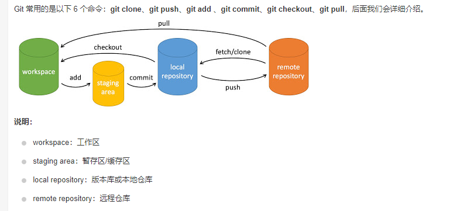
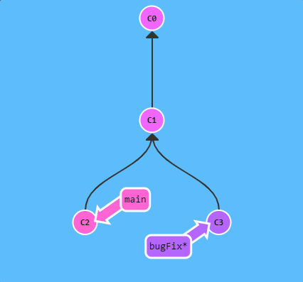
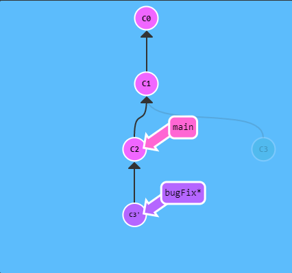
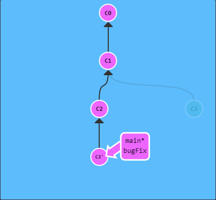

# Git命令大全-学习记录

学习网站：[Learn Git Branching](https://learngitbranching.js.org/?locale=zh_CN)

Git教程：[Git 教程 | 菜鸟教程 (runoob.com)](https://www.runoob.com/git/git-tutorial.html)


- [Git命令大全-学习记录](#git命令大全-学习记录)
  - [主要](#主要)
    - [基础篇](#基础篇)
      - [提交](#提交)
        - [一般步骤](#一般步骤)
      - [分支](#分支)
        - [一般步骤](#一般步骤-1)
      - [合并（merge）](#合并merge)
        - [一般步骤](#一般步骤-2)
      - [合并（rebase）](#合并rebase)
        - [一般步骤](#一般步骤-3)
    - [高级篇](#高级篇)
      - [分离 HEAD](#分离-head)
      - [](#)
        - [一般步骤](#一般步骤-4)
      - [相对引用](#相对引用)
        - [“^”操作符](#操作符)
        - [“~”操作符](#操作符-1)
        - [强制修改分支位置](#强制修改分支位置)
    - [移动提交记录](#移动提交记录)
    - [杂项](#杂项)
    - [高级话题](#高级话题)
  - [远程](#远程)
    - [Push & Pull —— Git 远程仓库](#push--pull--git-远程仓库)
    - [关于 origin 和它的周边 —— Git 远程仓库高级操作](#关于-origin-和它的周边--git-远程仓库高级操作)

## 主要：



### 基础篇：

#### 提交：

> - Git 仓库中的提交记录保存的是你的目录下所有文件的快照，就像是把整个目录复制，然后再粘贴一样，但比复制粘贴优雅许多！
> - Git 希望提交记录尽可能地轻量，因此在你每次进行提交时，它并不会盲目地复制整个目录。条件允许的情况下，它会将当前版本与仓库中的上一个版本进行对比，并把所有的差异打包到一起作为一个提交记录。
> - Git 还保存了提交的历史记录。这也是为什么大多数提交记录的上面都有父节点的原因 —— 我们会在图示中用箭头来表示这种关系。对于项目组的成员来说，维护提交历史对大家都有好处。

##### 一般步骤：

1. 使用 git add 命令将内容写入暂存区。
2. git commit 命令将暂存区内容添加到本地仓库中。

| 操作                                        | 描述                                                   |
| ------------------------------------------- | ------------------------------------------------------ |
| git commit -m [message]                     | 提交暂存区到本地仓库中，[message] 可以是一些备注信息。 |
| git commit [file1] [file2] ... -m [message] | 提交**暂存区**的指定文件到仓库区                       |
| git commit -a -m [message]                  | 略过 git add 步骤，直接写入暂存并提交                  |

- git commit 命令如果不写 -m [message] 添加提交信息的话，会尝试打开已配置编辑器要求输入提交信息。
- 如果 Git 在你对它的配置中找不到相关信息，默认会打开 vim。


#### 分支：

> - Git 的分支也非常轻量。它们只是简单地指向某个提交纪录 —— 仅此而已。
> - 这是因为即使创建再多的分支也不会造成储存或内存上的开销，并且按逻辑分解工作到不同的分支要比维护那些特别臃肿的分支简单多了。
> - 在将分支和提交记录结合起来后，我们会看到两者如何协作。现在只要记住使用分支其实就相当于在说：“我想基于这个提交以及它所有的父提交进行新的工作。”

##### 一般步骤：

1. 使用 git branch <branchname> 创建新分支。
2. 通过 git checkout <branchname> 切换到新创建的分支上。

| 操作                         | 描述                           |
| ---------------------------- | ------------------------------ |
| git branch <branchname>      | 创建分支                       |
| git checkout <branchname>    | 切换分支                       |
| git checkout -b <branchname> | 直接创建并切换到新创建的分支上 |


#### 合并（merge）：

> - merge操作将两个分支合并到一起。就是说我们新建一个分支，在其上开发某个新功能，开发完成后再合并回主线。

##### 一般步骤：

1. 假设当前有两个分支 `newbranch` 和 `main`，并且没有一个分支包含了我们修改的所有内容。所以我们需要合并分支。
2. （main）`git merge newbranch` 将`newbranch`的内容合并到`main`分支。
3. （main）`git checkout newbranch`切换到`newbranch`分支。
4. （newbranch）`git merge main`将新的`main`分支的内容更新到当前分支中。

| 操作                   | 描述                                     |
| ---------------------- | ---------------------------------------- |
| git merge <branchname> | 将<branchname>分支的内容合并到当前分支中 |


#### 合并（rebase）：

> - 第二种合并分支的方法是 `git rebase`。Rebase 实际上就是取出一系列的提交记录，“复制”它们，然后在另外一个地方逐个的放下去。
> - Rebase 的优势就是可以创造更线性的提交历史，这听上去有些难以理解。**如果只允许使用 Rebase 的话，代码库的提交历史将会变得异常清晰。**

##### 一般步骤：

1. 现在有两个并行开发的分支`bugFix`和`main`，当前分支为`bugFix`，现在需要将`bugFix`分支的内容＂复制＂到`main`分支，并且更新`main`分支。



2. （bugFix）使用`git rebase main`命令将`bugFix`的内容"复制"到`main`分支。



> 现在 bugFix 分支上的工作在 main 的最顶端，同时我们也得到了一个更线性的提交序列。
>
> 注意，提交记录 C3 依然存在（树上那个半透明的节点），而 C3' 是我们 Rebase 到 main 分支上的 C3 的副本。
>
> 现在唯一的问题就是 main 还没有更新，因此还需要对`main`进行更新.

3. （main）切换到 `main` 分支上。把它 rebase 到 `bugFix` 分支上。



> 由于 `bugFix` 继承自 `main`，所以 Git 只是简单的把 `main` 分支的引用向前移动了一下而已。

| 操作                    | 描述 |
| ----------------------- | ---- |
| git rebase <branchname> |      |


### 高级篇：

在接触 Git 更高级功能之前，必须有必要先学习在项目的提交树上**前后移动**的几种方法。

#### 分离 HEAD：

> - HEAD 是一个对当前检出记录的符号引用 —— 也就是指向你正在其基础上进行工作的提交记录。
> - HEAD 总是指向当前分支上最近一次提交记录。大多数修改提交树的 Git 命令都是从改变 HEAD 的指向开始的。
> - HEAD 通常情况下是指向分支名的（如 bugFix）。在你提交时，改变了 bugFix 的状态，这一变化通过 HEAD 变得可见。


观察下面命令提交前后 HEAD 的位置。

```shell
git checkout C1(哈希值)
```


```shell
git checkout main
```


```shell
git commit
```


```shell
git checkout C2(哈希值)
```


可以看到，HEAD 指向了 `main`，并随着提交向前移动。

#### 

**分离 HEAD 就是让其指向了某个具体的提交记录而不是分支名。在命令执行之前的状态如下所示：**

HEAD -> main -> C1 （HEAD 指向 main， main 指向 C1）


```shell
git checkout C1(哈希值)
```


现在变成了：HEAD -> C1

##### 一般步骤：

1. 从 `branch` 分支中分离出 HEAD 。
2. 通过提交记录的标签（哈希值）让其指向一个提交记录。`git checkout 哈希值`


#### 相对引用：

> - 通过指定提交记录哈希值的方式在 Git 中移动不太方便。一些情况下不得不用 git log 来查查看提交记录的哈希值。
> - 比较令人欣慰的是，Git 对哈希的处理很智能。你只需要提供哈希值中能够唯一标识提交记录的前几个字符即可。


正因为哈希值指定提交记录很不方便，所以Git引入了相对引用。

使用相对引用的话，你就可以从一个易于记忆的地方（比如 `bugFix` 分支或 `HEAD`）开始计算。

相对引用非常给力，这里我介绍两个简单的用法：

- 使用 `^` 向上移动 1 个提交记录
- 使用 `~<num>` 向上移动多个提交记录，如 `~3`


##### “^”操作符

> `main^` 相当于`main` 的父节点，`main^^` 是 `main` 的第二个父节点，`HEAD^`就是`HEAD`的上一个`HEAD`。
>
> 切换到`main`的父节点可以用 `git checkout main^` （此操作会让HEAD指向main的父节点）
>
> 我们可以一直使用 `HEAD^` 向上移动。`git checkout HEAD^`

| 操作                     | 描述                                                      |
| ------------------------ | --------------------------------------------------------- |
| git checkout branchname^ | 让HEAD指向branchname分支的父节点                          |
| git checkout HEAD^       | 让HEAD指向上一次HEAD的位置，可以一直使用 `HEAD^` 向上移动 |

##### “~”操作符

> 如果你想在提交树中向上移动很多步的话，敲那么多 `^` 貌似也挺烦人的，Git 当然也考虑到了这一点，于是又引入了操作符 `~`。
>
> 该操作符后面可以跟一个数字（可选，**不跟数字时与 `^` 相同，向上移动一次**），指定向上移动多少次。

| 操作                    | 描述                     |
| ----------------------- | ------------------------ |
| git checkout HEAD~<num> | `~<num>` 一次后退num步。 |


##### 强制修改分支位置：

相对引用最多的使用就是移动分支。可以直接使用 `-f` 选项让分支指向另一个提交。

例如：

```shell
git branch -f main HEAD~3
```

上面的命令会将 main 分支强制指向 HEAD 的第 3 级父提交。


总结：checkout改变HEAD的指向，branch -f移动分支。


### 移动提交记录：

### 杂项：

### 高级话题：


## 远程：

### Push & Pull —— Git 远程仓库

### 关于 origin 和它的周边 —— Git 远程仓库高级操作