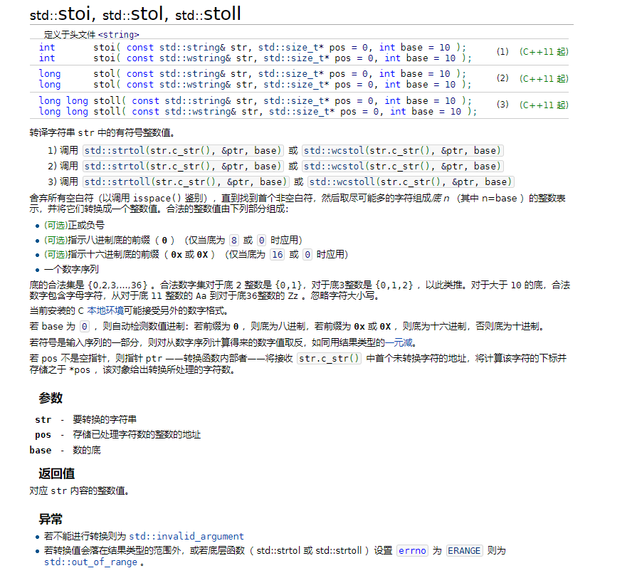
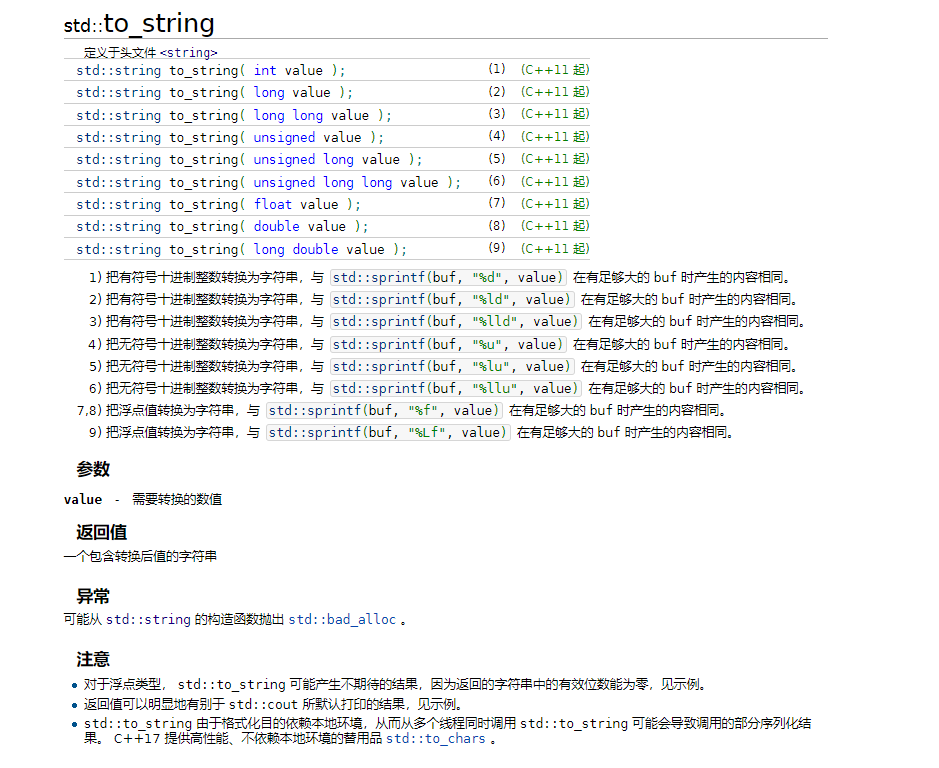

# C++常用数据类型间转换

[TOC]

## 强制类型转换：

强制类型转换一般是数值之间，如int、long、double、float、char之间，其中char为ASCII码值。

## string <--> int

### string --> int

- **stoi**

### int --> string

- **to_string**

## string <--> char

## string <--> char*
