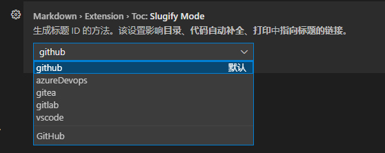

# Markdown生成TOC：

- [Markdown生成TOC：](#markdown生成toc)
    - [一、TOC标签直接生成](#一toc标签直接生成)
    - [二、手动生成](#二手动生成)
    - [三、VSCode插件（推荐）](#三vscode插件推荐)


### 一、TOC标签直接生成

```markdown
[TOC]
```

- 注：大多数情况下可使用方法一直接生成，但Github等网站可能不支持这种方式。


### 二、手动生成

**格式**：`[目录中显示的标题名称](#内容中的标题名称)` 

**简记**：`[Content](#URL)`

**示例**：`[Github生成TOC](#Github生成TOC)` [Github生成TOC：](#Github生成TOC)

- 特殊场合如果不支持标点符号等，可以将标题进行URL编码：

URL编码参考手册：[HTML URL 编码参考手册 (w3school.com.cn)](https://www.w3school.com.cn/tags/html_ref_urlencode.asp)

URL在线编码工具：[UrlEncode编码/UrlDecode解码 - 站长工具 (chinaz.com)](http://tool.chinaz.com/tools/urlencode.aspx)


### 三、VSCode插件（推荐）

**插件名**：Markdown All in One

**使用方法**：安装好后 -- `Ctrl + Shift + P`打开控制面板 -- 搜索`Create Table of Contents`回车自动生成TOC

**优点**：针对不同网站生成不同类型的TOC，默认为github。可以自动更新TOC。

- `设置` -- `扩展` -- `Markdown All in One` -- `Markdown › Extension › Toc: Slugify Mode` -- 修改`生成标题 ID 的方法`



- 取消保存自动更新TOC方式：`设置` -- `扩展` -- `Markdown All in One` -- `Markdown › Extension › Toc: Update On Save` -- 取消勾选。

**效果**(github)：

```markdown
- [Markdown生成TOC：](#markdown生成toc)
    - [一、TOC标签直接生成](#一toc标签直接生成)
    - [二、手动生成](#二手动生成)
    - [三、VSCode插件（推荐）](#三vscode插件推荐)
```

- github对标点符号和大小写都不敏感，将标题文字进行URL编码的时候也需要将标点符号去掉。（如下，两种方法均可在GitHub使用）

效果(vscode)：

```markdown
- [Markdown生成TOC：](#markdown%E7%94%9F%E6%88%90toc)
    - [一、TOC标签直接生成](#%E4%B8%80toc%E6%A0%87%E7%AD%BE%E7%9B%B4%E6%8E%A5%E7%94%9F%E6%88%90)
    - [二、手动生成](#%E4%BA%8C%E6%89%8B%E5%8A%A8%E7%94%9F%E6%88%90)
    - [三、VSCode插件（推荐）](#%E4%B8%89vscode%E6%8F%92%E4%BB%B6%E6%8E%A8%E8%8D%90)
```


**注**：azureDevops为完成URL编码，带标点。
